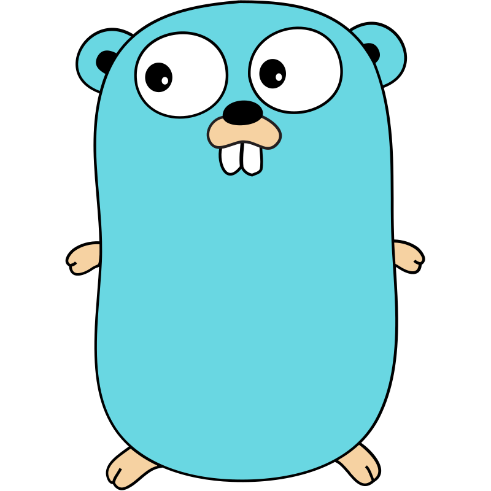

<samp>

ICT, last year, doing the internship, "self-hosted enthusiastic".
<a href="mailto:kiennguyen19323@gmail.com">kiennguyen19323@gmail.com</a><h1>Working on</h1><table><tr><td>2024</td><td><a href="https://github.com/Delnegend/social-2-telego">social-2-telego</a></td><td> Go, Telegram Bot API</td><td>Scrape tweets from formerly Twitter, repost to Telegram. This is a rewrite of <a href='https://https://github.com/Delnegend/social-2-telegram'>social-2-telegram</a> in Go.</td></tr><tr><td>2024</td><td><a href="https://github.com/Delnegend/towd">towd</a></td><td> Go, Nuxt, TailwindCSS, shadcn-vue, Discord Bot, iCalendar format</td><td><a href='https://https://github.com/anuraghazra/github-readme-stats'>github-readme-stats</a> but with Go.</td></tr><tr><td>2023</td><td><a href="https://github.com/Liminova/yomuyume">Liminova/yomuyume</a></td><td> Rust, Nuxt, TailwindCSS, Material Design 3</td><td><a href='https://https://komga.org/'>Komga</a> was an option, but it was slow.</td></tr><tr><td>2023</td><td><a href="https://github.com/gallery-preprocessor-py">gallery-preprocessor-py</a></td><td>Python</td><td>Dependency-free, tightly compacted gallery pre-processor for Yomuyume.</td></tr></table><h1>Archived</h1><table><tr><td>2023</td><td><a href="https://github.com/Liminova/MobDevProj-Covid">Liminova/MobDevProj-Covid</a></td><td>Kotlin, Jetpack Compose, Material Design 3</td><td>Covid-19 Statistic App. Since at this time, there is no free+good+reliable API, <a href='https://https://github.com/Liminova/covid-api'>I built my own</a>. Weekly update <a href='https://https://covid19.who.int/WHO-COVID-19-global-data.csv'>from WHO</a></td></tr><tr><td>2023</td><td><a href="https://github.com/Delnegend/social-2-telegram">social-2-telegram</a></td><td>Python, Selenium (web scraping), Telegram Bot API</td><td>Scrape tweets from formerly Twitter, repost to Telegram.</td></tr><tr><td>2023</td><td><a href="https://github.com/Liminova/human-resource-manager">Liminova/human-resource-manager</a></td><td>Python, Tkinter</td><td>A project for our Advanced Python course.</td></tr><tr><td>2023</td><td><a href="https://github.com/Delnegend/food-ordering-app">food-ordering-app</a></td><td>React, TailwindCSS</td><td>The client for a food ordering app I made for the USTH Coding Club that was never completed. The client was kind of, but I had never seen the server API documentation.</td></tr><tr><td>2020 2021</td><td><a href="https://github.com/Delnegend/khplayer">khplayer</a></td><td>HTML, CSS, jQuery</td><td>Bootstrapping a <a href='https://https://github.com/sampotts/plyr'>Plyr.io</a> player with just a few lines of HTML. This was done back when I started exercising web development.</td></tr></table><h1>Tiny things</h1><table><tr><td>2024</td><td><a href="https://github.com/Delnegend/moveme">moveme</a></td><td> Go</td><td>Simple URL redirect server.</td></tr><tr><td>2023</td><td><a href="https://github.com/Delnegend/scripts">scripts</a></td><td>Python</td><td>A bunch of small python scripts.</td></tr><tr><td>2023</td><td><a href="https://github.com/Delnegend/dracoder">dracoder</a></td><td> Rust</td><td>Drag and drop video/image to an executable to transcode (using <a href='https://https://ffmpeg.org/'>ffmpeg</a>), the target format based on the executable file name.</td></tr><tr><td>2023</td><td><a href="https://github.com/Delnegend/cemail-i">cemail-i</a></td><td> Rust</td><td>Simple command line interface email client, when I was getting familiar with Rust.</td></tr><tr><td>2023</td><td><a href="https://github.com/Delnegend/blurhash-cli">blurhash-cli</a></td><td> Rust</td><td>Handy dandy CLI tool to encode images to <a href='https://https://blurha.sh'>blurha.sh</a>.</td></tr><tr><td>2023</td><td><a href="https://github.com/Delnegend/ffmpeg-progressbar">ffmpeg-progressbar</a></td><td> Go</td><td>Ffmpeg wrapper with progress bar.</td></tr><tr><td>2023</td><td><a href="https://github.com/Delnegend/gallery-preprocessor-go">gallery-preprocessor-go</a></td><td> Go</td><td>The same as the gallery preprocessor above, but in Go.</td></tr><tr><td>2023</td><td><a href="https://github.com/Delnegend/fshare-cli">fshare-cli</a></td><td>Python</td><td>Fshare CLI client.</td></tr><tr><td>2023</td><td><a href="https://github.com/Delnegend/embed-video">embed-video</a></td><td>JS</td><td>Wrapping direct video URL to <a href='https://https://github.com/sampotts/plyr'>Plyr.io</a> for embedding to Notion.</td></tr><tr><td>2023</td><td><a href="https://github.com/Delnegend/cctv-splitter">cctv-splitter</a></td><td>Python, <a href='https://github.com/tesseract-ocr/tesseract'>tesseract</a></td><td>Made an oopsy daisy in a script that merges 1-minute segment files to 1-day files from my security camera. Delayed for too long, the messed up footage was discarded for newer ones. Never had a chance to finish the project.</td></tr><tr><td>2022</td><td><a href="https://github.com/Delnegend/8MB">8MB</a></td><td> Go</td><td>Re-encode video to fit 8MB Discord file size limit for non-Nitro users. Don&apos;t use the method in this repo.</td></tr><tr><td>2021</td><td><a href="https://github.com/Delnegend/calendar-filtering">calendar-filtering</a></td><td>JS, iCalendar</td><td>Our university gave us one big-ass Google Calendar feed, this was an attempt to split it into classes.</td></tr><tr><td>2020</td><td><a href="https://github.com/Delnegend/Delnegend-rEFInd">Delnegend-rEFInd</a></td><td>-</td><td>Custom rEFInd theme back when I was dual-boot Windows-Linux or Windows-Hackintosh.</td></tr></table>

</samp>